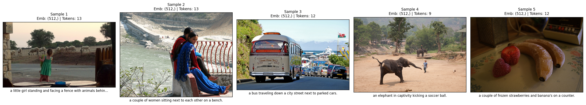
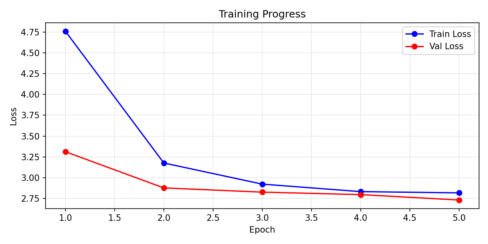
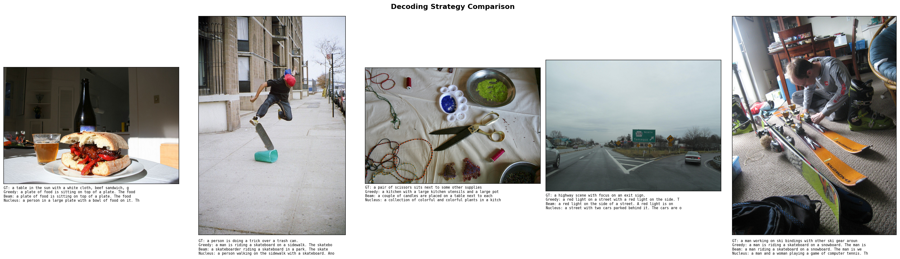

# Image Captioning with CLIP and GPT-2

An end-to-end image captioning pipeline that generates natural language descriptions from images using a **CLIP** vision encoder, a learned **mapping network**, and **GPT-2** fine-tuned with **LoRA**.

> Generative AI Course Project

---

## Architecture

```
┌─────────────┐     ┌──────────────────┐     ┌─────────────────────┐
│   Image     │     │ Mapping Network  │     │   GPT-2 + LoRA      │
│   CLIP      │────▶│   (MLP)          │────▶│   Caption Decoder   │
│  ViT-B/32   │     │ 512 → 10×768     │     │                     │
│  (frozen)   │     │ (trained)        │     │   (fine-tuned)      │
└─────────────┘     └──────────────────┘     └─────────────────────┘
   512-dim emb        prefix tokens          "a dog playing fetch"
```

---

## Sample Output

### Milestone 1 — Pipeline Verification


### Milestone 2 — Training & Decoding Comparison



---

## Project Status

| Milestone | Description | Status |
|-----------|-------------|--------|
| M1 | Data pipeline, CLIP embeddings, GPT-2 tokenization, proposal | ✅ Complete |
| M2 | CLIP+GPT-2 integration, training, decoding strategy experiments | 🔄 In Progress |
| M3 | Evaluation (BLEU/CIDEr metrics) and inference demo | ⬚ Upcoming |
| M4 | Final report and presentation | ⬚ Upcoming |

---

## Team

| Member | Role |
|--------|------|
| A | Data Pipeline & Embeddings |
| B | Model Architecture |
| C | Training & Evaluation |
| D | Inference & Presentation |

---

## Quick Start

### Prerequisites

- Python 3.10+
- macOS with Apple Silicon (MPS) or Google Colab (GPU) for training
- ~4 GB disk space for model weights and dataset cache

### Installation

```bash
git clone https://github.com/heisenberg1804/image-captioning-with-CLIP-and-GPT-2.git
cd image-captioning-with-CLIP-and-GPT-2

python -m venv venv
source venv/bin/activate

pip install -r requirements.txt
```

### Run Milestone 1 — Sample Test

```bash
cd src
python run_samples.py
```

This will download a 2,500-pair subset of COCO Captions, generate CLIP embeddings and GPT-2 tokenizations for 5 samples, and save a visual grid to `outputs/sample_test_runs.png`.

### Test Individual Components

```bash
python data_preprocessing.py    # Data loading and cleaning only
python embedding_pipeline.py    # CLIP + GPT-2 tokenizer only
```

---

## Project Structure

```
├── README.md
├── requirements.txt
├── docs/
│   └── proposal.md               # Project proposal (Milestone 1)
├── src/
│   ├── config.py                 # Paths, model names, device config
│   ├── data_preprocessing.py     # Dataset download, cleaning, subsetting
│   ├── embedding_pipeline.py     # CLIP embedder + GPT-2 tokenizer
│   └── run_samples.py            # 5 sample test runs with visual grid
├── data/
│   └── hf_cache/                 # HuggingFace cache (auto-created, gitignored)
└── outputs/
    └── sample_test_runs.png      # Milestone 1 visual deliverable
```

---

## Dataset

**[`yerevann/coco-karpathy`](https://huggingface.co/datasets/yerevann/coco-karpathy)** — the standard Karpathy split of MS COCO Captions.

| Split | Images |
|-------|--------|
| Train | 82,783 |
| Validation | 5,000 |
| Test | 5,000 |

Each image has 5 human-written captions. We use a 2,500-pair subset for Milestone 1, scaling up for training.

**Preprocessing:** lowercase normalization, special character removal, whitespace collapsing, caption length filtering (4–60 words), RGB conversion, minimum image size validation (64×64).

---

## Tech Stack

| Component | Purpose |
|-----------|---------|
| [CLIP ViT-B/32](https://huggingface.co/openai/clip-vit-base-patch32) | Image → 512-dim embedding (frozen) |
| [GPT-2](https://huggingface.co/gpt2) + LoRA | Caption generation (fine-tuned) |
| Mapping Network (MLP) | Projects CLIP space → GPT-2 embedding space |
| [COCO Captions](https://huggingface.co/datasets/yerevann/coco-karpathy) | Image-caption pair dataset |
| PyTorch | MPS (Apple Silicon) / CUDA (Colab) |
| HuggingFace Transformers | Model loading and tokenization |
| PEFT | LoRA parameter-efficient fine-tuning |

---

## Documentation

- **[Project Proposal](docs/proposal.md)** — architecture, dataset, team roles, evaluation plan, timeline

---

## License

MIT