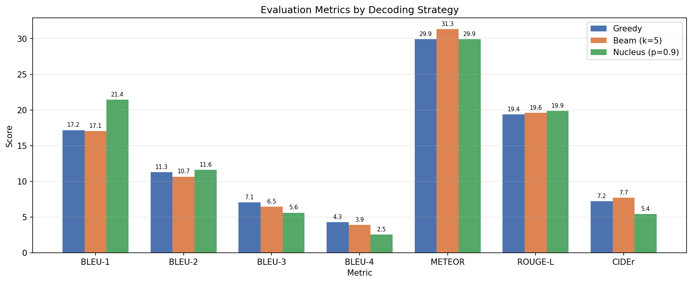
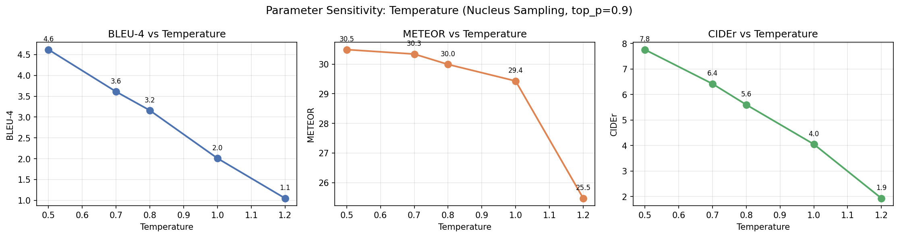
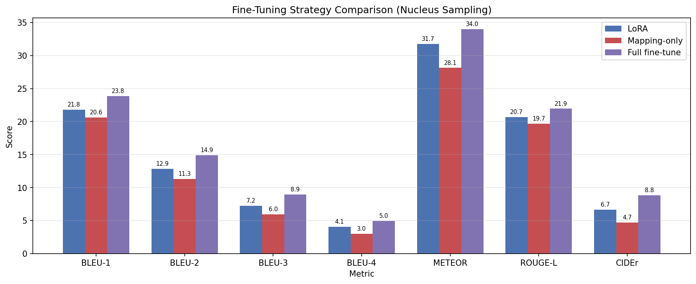

# Image Captioning with CLIP and GPT-2

An end-to-end image captioning pipeline that generates natural language descriptions from images using a **CLIP** vision encoder, a learned **mapping network**, and **GPT-2** fine-tuned with **LoRA**.

> Generative AI Course Project

---

## Architecture

```
┌─────────────┐     ┌──────────────────┐     ┌─────────────────────┐
│   Image     │     │ Mapping Network  │     │   GPT-2 + LoRA      │
│   CLIP      │────▶│   (MLP)          │────▶│   Caption Decoder   │
│  ViT-B/32   │     │ 512 → 10×768     │     │                     │
│  (frozen)   │     │ (trained)        │     │   (fine-tuned)      │
└─────────────┘     └──────────────────┘     └─────────────────────┘
   512-dim emb        prefix tokens          "a dog playing fetch"
```

---

## Results

### Milestone 1 — Pipeline Verification
5 image-caption pairs processed through CLIP embedding + GPT-2 tokenization:


### Milestone 2 — Training & Caption Generation

Training loss over 5 epochs (2,500 COCO pairs, LoRA fine-tuning on T4 GPU):


Decoding strategy comparison — greedy vs beam search vs nucleus sampling:


### Milestone 3 — Quantitative Evaluation

Evaluation metrics (BLEU, METEOR, ROUGE-L, CIDEr) across decoding strategies on 100 validation samples:



Temperature sensitivity — all metrics degrade as temperature increases:



Fine-tuning strategy comparison — LoRA vs mapping-only vs full fine-tune:



Qualitative analysis — image-caption alignment across 8 diverse samples:


---

## Project Status

| Milestone | Description | Status |
|-----------|-------------|--------|
| M1 | Data pipeline, CLIP embeddings, GPT-2 tokenization, proposal | ✅ Complete |
| M2 | CLIP+GPT-2 integration, training, decoding strategy experiments | ✅ Complete |
| M3 | Quantitative evaluation, parameter sensitivity, fine-tuning comparison | ✅ Complete |
| M4 | Final report and presentation | ⬚ Upcoming |

---

## Key Findings

- **No single decoding strategy dominates** — beam search excels at METEOR/CIDEr, nucleus at BLEU-1/ROUGE-L, greedy at BLEU-4
- **Temperature is the most impactful parameter** — BLEU-4 ranges 4.4× across temperature values vs only 1.1× across beam widths
- **LoRA achieves 82% of full fine-tune performance with 0.6% of trainable parameters** — best efficiency-quality tradeoff
- **Full fine-tune wins on all absolute metrics** — BLEU-4: 4.97, METEOR: 33.98, CIDEr: 8.84

---

## Team

| Member | Role |
|--------|------|
| A | Data Pipeline & Embeddings |
| B | Model Architecture & Metrics |
| C | Training & Parameter Sensitivity |
| D | Fine-Tuning Comparison & Reports |

---

## Quick Start

### Prerequisites

- Python 3.10+
- macOS with Apple Silicon (MPS) or Google Colab (GPU) for training
- ~4 GB disk space for model weights and dataset cache

### Installation

```bash
git clone https://github.com/heisenberg1804/image-captioning-with-CLIP-and-GPT-2.git
cd image-captioning-with-CLIP-and-GPT-2

python -m venv venv
source venv/bin/activate

pip install -r requirements.txt
```

### Run Milestone 1 — Sample Test

```bash
cd src
python run_samples.py
```

### Run Milestone 2 & 3 — Training & Evaluation (Colab)

Upload the notebooks from `notebooks/` to Google Colab with a T4 GPU runtime:

1. `milestone1_notebook.ipynb` — data pipeline and baseline demo
2. `milestone2_notebook.ipynb` — model training and caption generation
3. `milestone3_notebook.ipynb` — evaluation, parameter sweeps, fine-tuning comparison

---

## Project Structure

```
├── README.md
├── requirements.txt
├── docs/
│   ├── proposal.md                                    # M1 project proposal
│   ├── Generative Project Milestone-1-IE7615.pdf      # M1 submission
│   ├── Generative Project Milestone-2-IE7615.pdf      # M2 submission
│   └── Generative Project Milestone 3 — Evaluation... # M3 report
├── notebooks/
│   ├── milestone1_notebook.ipynb     # M1: Data pipeline (Colab-ready)
│   ├── milestone2_notebook.ipynb     # M2: Training + decoding (Colab-ready)
│   └── milestone3_notebook.ipynb     # M3: Evaluation + sweeps (Colab-ready)
├── src/
│   ├── config.py                     # Paths, model names, device config
│   ├── data_preprocessing.py         # Dataset download, cleaning, subsetting
│   ├── embedding_pipeline.py         # CLIP embedder + GPT-2 tokenizer
│   └── run_samples.py               # M1 sample test runs with visual grid
├── data/
│   └── hf_cache/                     # HuggingFace cache (gitignored)
├── milestone3/
│   └── best_model.pt                 # Trained LoRA model checkpoint
└── outputs/
    ├── sample_test_runs.png          # M1 visual output
    ├── training_curves.png           # M2 loss curves
    ├── training_log.json             # M2 per-epoch metrics
    ├── decoding_comparison.png       # M2 strategy comparison
    ├── metrics_by_strategy.png       # M3 evaluation bar chart
    ├── temperature_sweep.png         # M3 temperature sensitivity
    ├── beam_width_sweep.png          # M3 beam width sensitivity
    ├── finetuning_comparison.png     # M3 LoRA vs mapping vs full
    ├── finetuning_training_curves.png # M3 variant loss curves
    ├── qualitative_samples.png       # M3 image-caption alignment
    └── evaluation_results.json       # M3 all metrics (structured)
```

---

## Dataset

**[`yerevann/coco-karpathy`](https://huggingface.co/datasets/yerevann/coco-karpathy)** — the standard Karpathy split of MS COCO Captions.

| Split | Images |
|-------|--------|
| Train | 82,783 |
| Validation | 5,000 |
| Test | 5,000 |

Each image has 5 human-written captions. We use 2,500 training pairs and 100 validation pairs for evaluation.

---

## Tech Stack

| Component | Purpose |
|-----------|---------|
| [CLIP ViT-B/32](https://huggingface.co/openai/clip-vit-base-patch32) | Image → 512-dim embedding (frozen) |
| [GPT-2](https://huggingface.co/gpt2) + LoRA | Caption generation (fine-tuned) |
| Mapping Network (MLP) | Projects CLIP space → GPT-2 embedding space |
| [COCO Captions](https://huggingface.co/datasets/yerevann/coco-karpathy) | Image-caption pair dataset |
| PyTorch | MPS (Apple Silicon) / CUDA (Colab) |
| HuggingFace Transformers | Model loading and tokenization |
| PEFT | LoRA parameter-efficient fine-tuning |

---

## Documentation

- **[Project Proposal](docs/proposal.md)** — architecture, dataset, team roles
- **[Milestone 2 Report](docs/Generative%20Project%20Milestone-2-IE7615.pdf)** — training log, decoding strategy analysis
- **[Milestone 3 Report](docs/Generative%20Project%20Milestone%203%20—%20Evaluation%2C%20Para...)** — quantitative evaluation, parameter sensitivity, fine-tuning comparison

---

## License

MIT